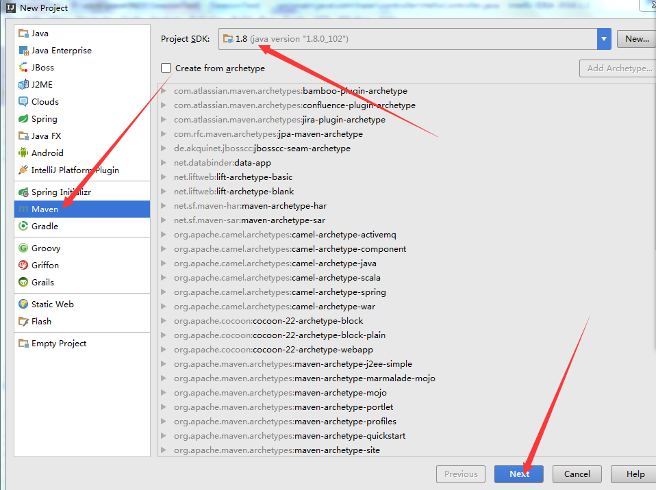
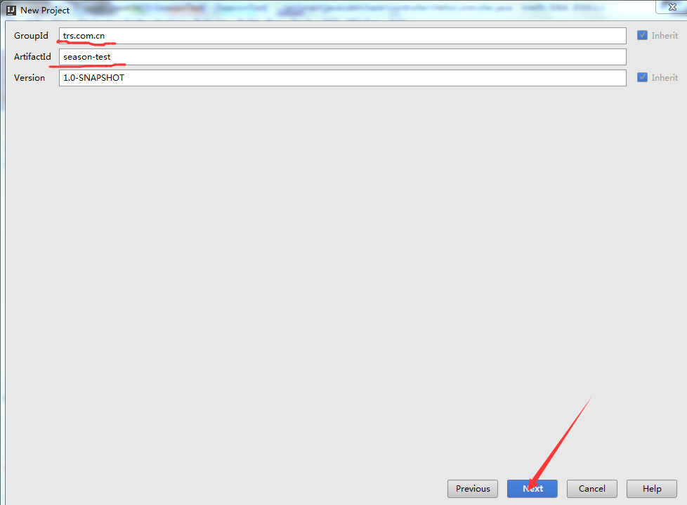
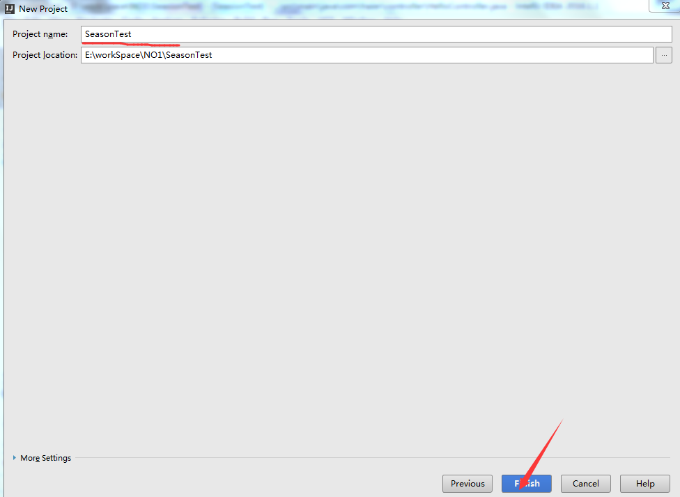
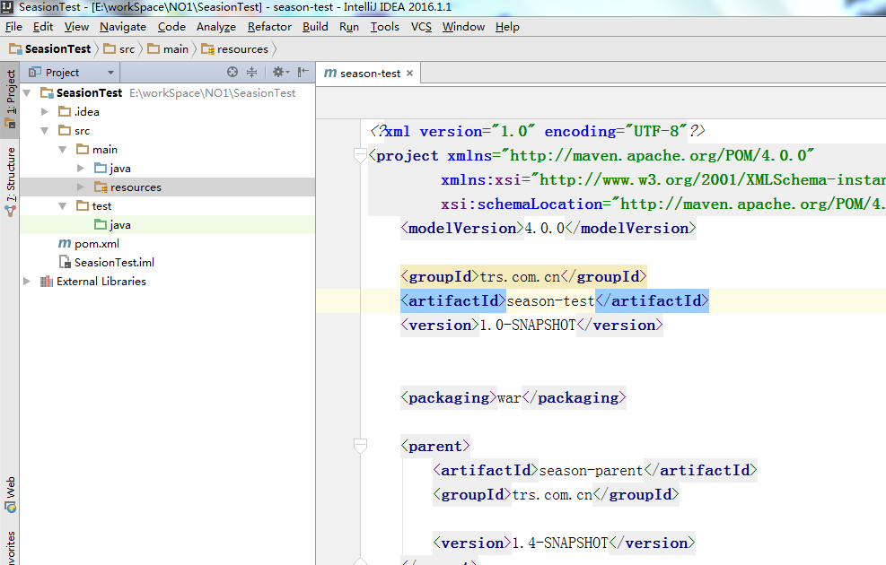
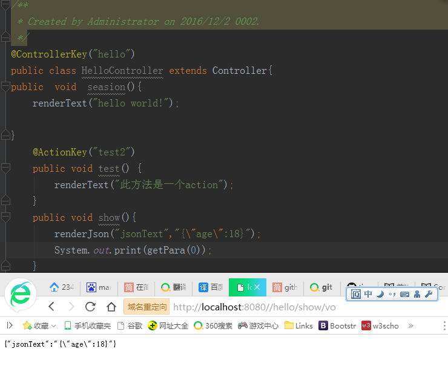
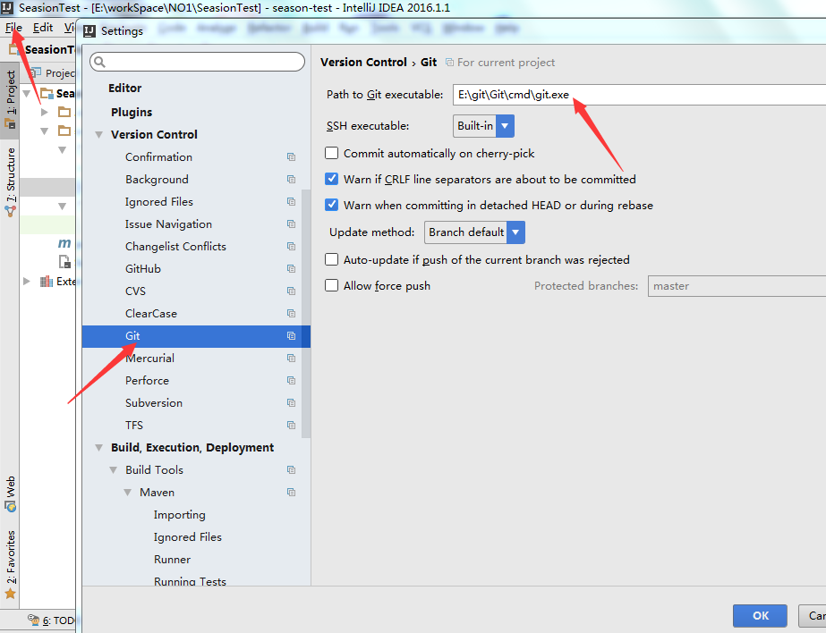
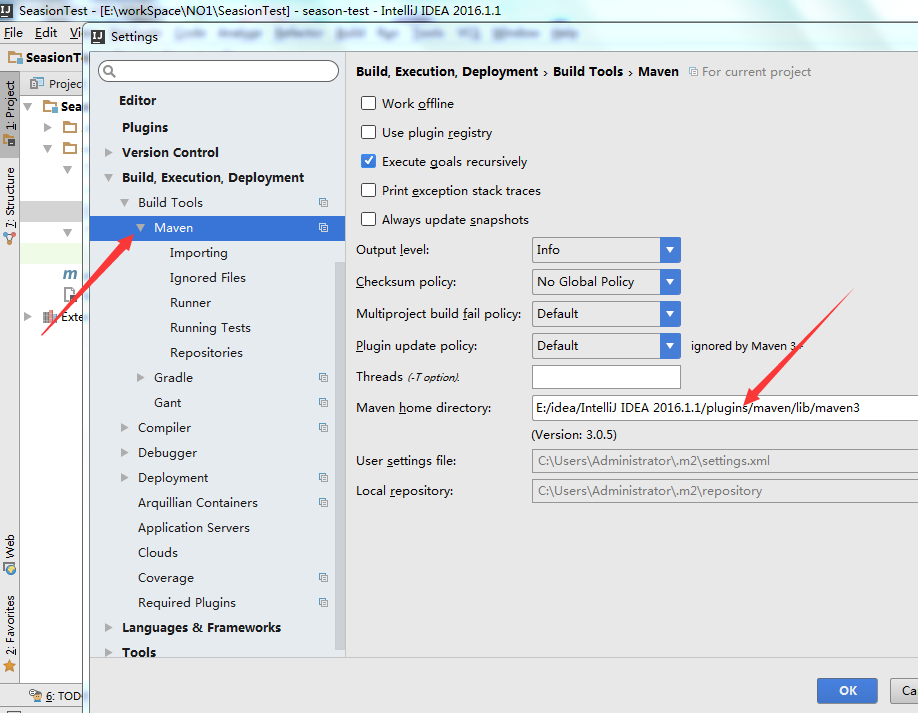

#使用IDEA创建第一个maven项目
IDEA第一个项目连接
[项目详情链](https://github.com/tinghuaxiaobai/SeasonTes/tree/master/SeasonTest)
##1.HelloWorld
###新建maven工程
	选择File-New-Project然后如图所示

jdk选择1.7以上，我选的是1.8。填写maven信息

GroupId必须填写为trs.com.cn，ArtifactId填写为你的应用名称，版本号默认即可。

填写项目信息

点击完成，即项目创建完成。结构如下。

配置pom.xml,具体配置代码在项目中

1.2 创建启动类

创建一个类，继承com.season.core.spring.SeasonApplication，添加main方法

    public static void main(String[] args){
        SeasonRunner.run(App.class);
    }
1.4 创建Controller

新建HelloController，继承com.season.core.Controller，添加@ControllerKey注解。新建类所属的包名必须是com开始，因 Season 默认配置的 Spring 扫描包为com。

    @ControllerKey("hello")
    public class HelloController extends Controller{
        public void season(){
            renderText("hi season!");
        }
    }
然后重启main方法，访问http://localhost:8080/hello/season，即可看见效果。

在IDEA配置git

在IDEA中配置maven

