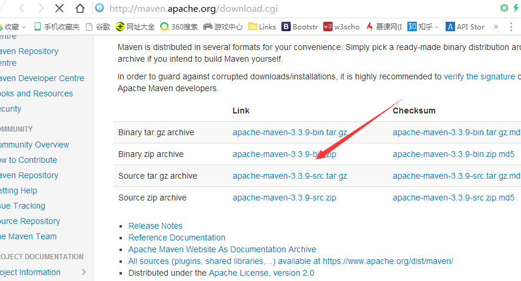
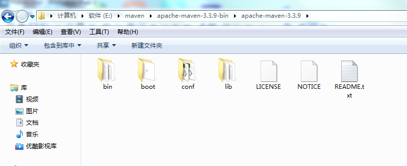
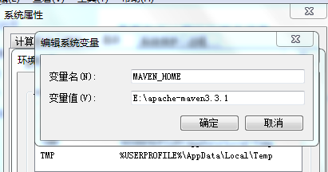
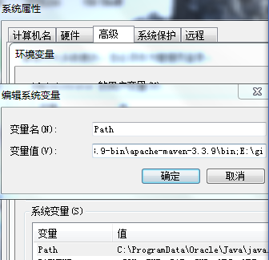
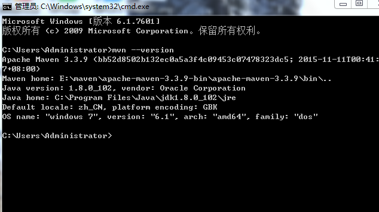

#maven
###什么是maven，好处是什么
	Maven是一个项目管理的Java 工具，在JavaEE中，我们可以使用Maven方便地管理团队合作的项目，使用Maven可以管理类库，有效方便地供团队中的其他人员使用。
    Maven是一个构建工具,服务与构建.使用Maven配置好项目后,输入简单的命令,如:mvn clean install,Maven会帮我们处理那些繁琐的任务.
	Maven是跨平台的.
	Maven最大化的消除了构建的重复.
	Maven可以帮助我们标准化构建过程.所有的项目都是简单一致的,简化了学习成本.
	总之,Maven作为一个构建工具,不仅帮我们自动化构建,还能抽象构建过程,提供构建任务实现.他跨平台,对外提供一致的操作接口,这一切足以使他成为优秀的,流行的构建工具.
	但是Maven不仅是构建工具,他还是一个依赖管理工具和项目信息管理工具.他还提供了中央仓库,能帮我们自动下载构件.
	使用Maven还能享受一个额外的好处，即Maven对于项目目录结构、测试用例命名方式等内容都有既定的规则，只要遵循了这些成熟的规则，用户在项目间切换的时候就免去了额外的学习成本，可以说是约定优于配置。
 1.下载maven
    [下载链接](http://maven.apache.org/download.cgi)
	选取好下载版本,我下载的是apache-maven-3.3.9

 2.maven配置
下载安装之后的目录

3.环境变量配置
	
	右键“计算机”，选择“属性”，之后点击“高级系统设置”，点击“环境变量”，来设置环境变量，
	有以下系统变量需要配置：
	新建系统变量   MAVEN_HOME  变量值：D:\Java\apache-maven-3.1.1
	编辑系统变量  Path         添加变量值： ;%MAVEN_HOME%\bin

4.测试成功验证

	打开命令行提示符窗口，即Dos界面，输入mvn --version  若出现以下情况说明配置成功

#maven基本常识
	1、mvn -v ：查看当前Maven的版本。
	
	2、mvn compile：编译项目
	
	3、mvn test ：先编译然后执行测试代码
	
	4、mvn package：生成target目录，编译、测试代码，生成测试报告，生成jar/war文件
	
	5、mvn clean：删除target(编译生成的字节码和测试报告)
	
	6、mvn install：将打包生成的Jar文件存放到本地仓库，方便以后其他项目调用，直接在pom.xml中添加依赖即可。
	
	7、mvn javadoc:jar生成对应的javadoc
	
	在Maven项目的根目录即pom.xml文件所在的目录下使用mvn javadoc:jar可以生成当前项目对应的java doc。
	
	8、使用mvn dependency:sources下载对应的源码
	
	在Maven项目的根目录即pom.xml文件所在的目录下使用mvn dependency:sources可以下载对应依赖包的源码。
	S
	使用Maven来管理项目的目录骨架：
	
	src |--------main 主要代码 |---java |----package |---------test 测试代码 |--java |---package |----------resources pom.xml
#maven教程详情
[教程详情连接](http://www.yiibai.com/maven/)