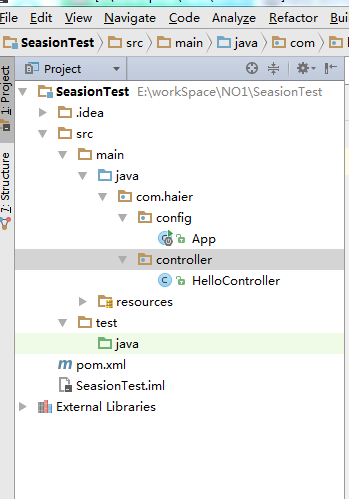
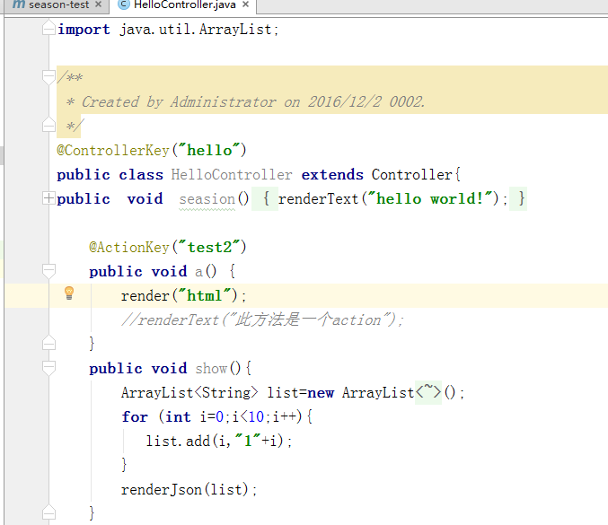
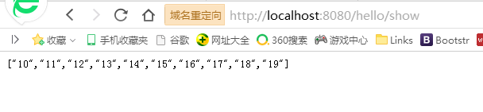

#1.Season项目目录结构

##2.创建Controller
新建Controller类， 继承自Controller（com.season.core.Controller）, 并添加注解@ControllerKeym注解。 新建类所属的包名必须以com开头(因为Season默认配置的Spring扫描包为com)

Controller以及在其中定义的public无参方法称为一个Action。Action是请求的最小单位。Action 方法必须在 Controller 中声明, 该方法必须是 public 可见性且没有形参。Controller上必须添加ControllerKey注解，用于指定nameSpace和viewPath，nameSpace必填， 如果没有指定viewPath，则viewPath就是nameSpace。同时Spring Bean的名称也为nameSpace。
##结果图
