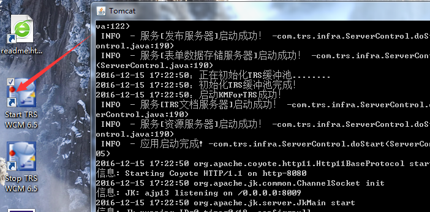
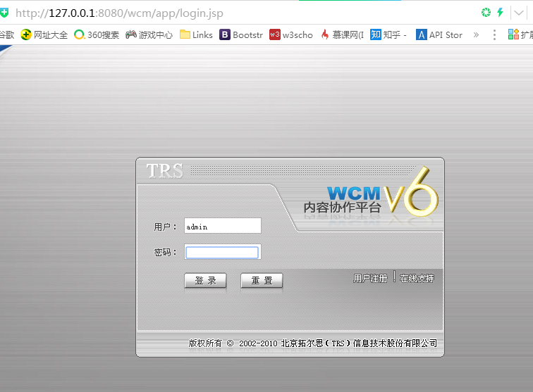
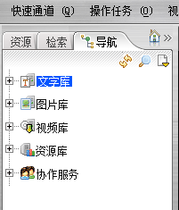
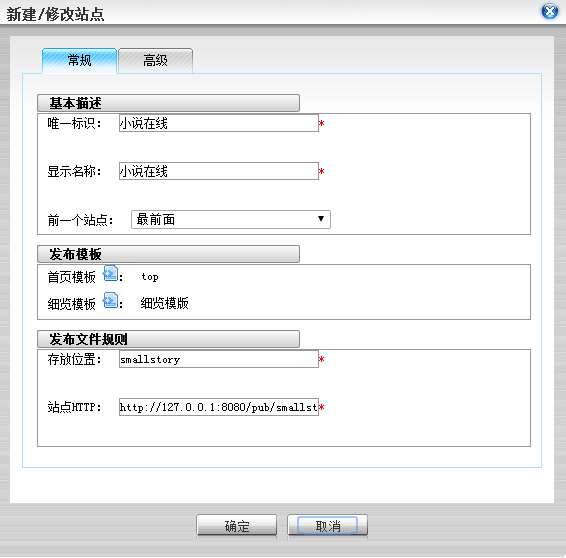
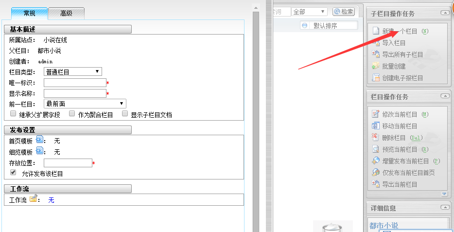
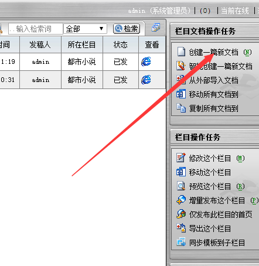
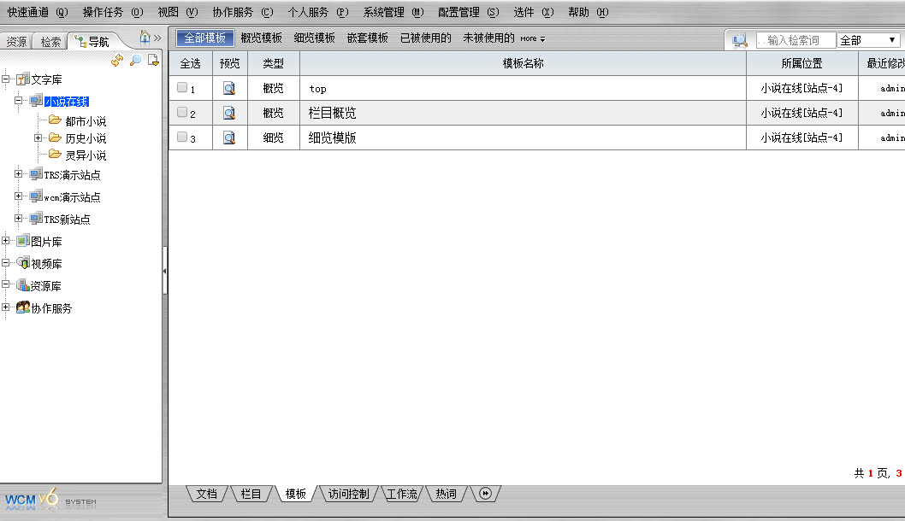
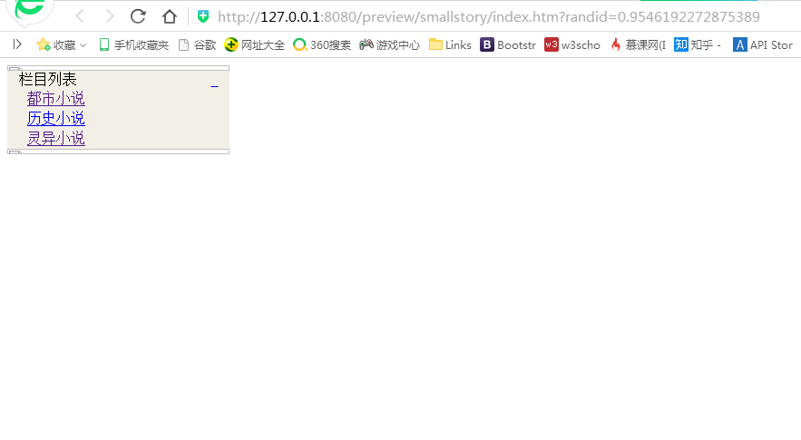

#WCM
###1,安装后启动：

###2,登陆界面

###3,wcm是什么
	TRS-WCM是一个内容协作平台，是一套基于java和浏览器技术的网络内容管理软件，它具有内容创建，站点管理，系统维护等功能，是一块强大的内容管理软件。
	
	它提供一套强大的站点建立、管理工具，同时能够实现一定的权限控制和流程控制，保证系统的安全。
	页面发布过程中，依靠程序自动结合HTML模板和数据库中的数据，生成最终的HTML页面，同时可以自动生成页面的链接而不用手动干预
#4,视图
视图是指计算机数据库中的视图，是一个虚拟表，其内容由查询定义。
同真实的表一样，视图包含一系列带有名称的列和行数据。但是，视图并不在数据库中以存储的数据值集形式存在。行和列数据来自由定义视图的查询所引用的表，并且在引用视图时动态生成。
#5,元数据
元数据（Meta Date），关于数据的数据或者叫做用来描述数据的数据或者叫做信息的信息。

元数据的特点：

	 ①元数据是关于数据的结构化的数据，它不一定是数字形式的，可来自不同的资源。
	
	　　②元数据是与对象相关的数据，此数据使其潜在的用户不必先具备对这些对象的存在和特征的完整认识。
	
	　　③元数据是对信息包裹(Information Package)的编码的描述。
	
	　　④元数据包含用于描述信息对象的内容和位置的数据元素集，促进了网络环境中信息对象的发现和检索。
	
	　　⑤元数据不仅对信息对象进行描述，还能够描述资源的使用环境、管理、加工、保存和使用等方面的情况。
	
	　　⑥在信息对象或系统的生命周期中自然增加元数据。
	
	　　⑦元数据常规定义中的“数据”是表示事务性质的符号，是进行各种统计、计算、科学研究、技术设计所依据的数值，或是说数字化、公式化、代码化、图表化的信息。

#6,库
多个站点的集合，分为文字库，图片库，资源库和视频库等

###7,站点
负责组织和管理栏目，位于库目录下
创建站点

###8,栏目
用来组织和管理文档，必须依附于站点之下

###9文档
wcm系统的基本单元，也是系统的核心数据内容，依赖于栏目下
文档必须"发布"，才能被置标引用，在预览站点时，在页面中得到文档的值。
点击文档然后如图操作

###10，
模版：用来控制发布网页的显示，站点，栏目，文档都可以有不同的模版

	分类：
	概览模板：包括主页模板和各栏目的概览模板。
	
	细览模板：各栏目的细览模板。
	
	嵌套模板：可嵌套的通用模板。

发布：将数据与模版结合生成HTML页面
预览：在对象发布之前，观看效果

预览站点
