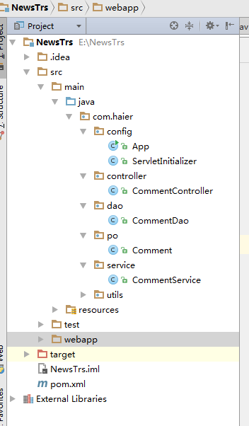

#产品评论
[项目地址连接](https://github.com/tinghuaxiaobai/TRSstudy/tree/master/NewsTrs)

 1，分析项目流程

	用户点击列表——进入产品详情页——查看信息——添加评论——查看评论
 2，创建数据库表

3，项目结构

#项目代码
####1，pom.xml
		<?xml version="1.0" encoding="UTF-8"?>
	<project xmlns="http://maven.apache.org/POM/4.0.0"
	         xmlns:xsi="http://www.w3.org/2001/XMLSchema-instance"
	         xsi:schemaLocation="http://maven.apache.org/POM/4.0.0 http://maven.apache.org/xsd/maven-4.0.0.xsd">
	    <modelVersion>4.0.0</modelVersion>
	
	    <groupId>trs.com.cn</groupId>
	    <artifactId>news-trs</artifactId>
	    <version>1.0-SNAPSHOT</version>
	
	    <packaging>war</packaging>
	
	    <parent>
	        <artifactId>season-parent</artifactId>
	        <groupId>trs.com.cn</groupId>
	        <version>1.4-SNAPSHOT</version>
	    </parent>
	
	
	    <dependencies>
	        <dependency>
	            <groupId>trs.com.cn</groupId>
	            <artifactId>season-core</artifactId>
	            <version>1.4-SNAPSHOT</version>
	        </dependency>
	    </dependencies>
	
	    <build>
	        <finalName>SeasonTest</finalName>
	        <plugins>
	            <plugin>
	                <groupId>org.springframework.boot</groupId>
	                <artifactId>spring-boot-maven-plugin</artifactId>
	            </plugin>
	        </plugins>
	    </build>
	
	    <repositories>
	        <repository>
	            <id>haier-maven-repository</id>
	            <url>http://test.haier.com/nexus/content/groups/public/</url>
	        </repository>
	    </repositories>
	</project>
###2,JDBC连接
	season.datasources[0].id=mydb
	season.datasources[0].url=jdbc:mysql://localhost:3306/mydb?useUnicode=true&characterEncoding=UTF-8&autoReconnect=true&failOverReadOnly=false&zeroDateTimeBehavior=convertToNull
	season.datasources[0].username=root
	season.datasources[0].password=123

###3，数据访问层
	package com.haier.po;
	
	import com.season.core.db.Pojo;
	import com.season.core.db.annotation.TableInfo;
	import com.season.core.db.annotation.Transient;
	
	import java.util.Date;
	
	/**
	 * Created by Administrator 
	 */
	@TableInfo(tableName =Comment.tableName ,pkName = "id")
	public class Comment extends Pojo<Comment>{
	    @Transient
	    public final static String tableName="comment";
	    private Integer id;
	    private  String name;
	    private  String content;
	    private Date Date;
	
	    public java.util.Date getDate() {
	        return Date;
	    }
	
	    public void setDate(java.util.Date date) {
	        Date = date;
	    }
	
	    public String getName() {
	        return name;
	    }
	
	    public void setName(String name) {
	        this.name = name;
	    }
	
	    public Integer getId() {
	        return id;
	    }
	
	    public void setId(Integer id) {
	        this.id = id;
	    }
	
	    public String getContent() {
	        return content;
	    }
	
	    public void setContent(String content) {
	        this.content = content;
	    }
	    public Comment() {
	    }
	    public Comment(Integer id, String name, String content, java.util.Date date) {
	        this.id = id;
	        this.name = name;
	        this.content = content;
	        Date = date;
	    }
	
	    public Comment(String name, String content) {
	        this.name = name;
	        this.content = content;
	    }
	}
###4，持久层
	package com.haier.dao;
	
	import com.haier.po.Comment;
	import com.season.core.db.Dao;
	import org.springframework.stereotype.Repository;
	
	import java.util.List;
	
	/**
	 * Created by Administrator
	 */
	@Repository
	public class CommentDao {
	
	    public List<Comment> getCommentByName(String name){
	        return Dao.findByColumn(Comment.class,"name",name);
	    }
	
	    /**
	     * 保存评论
	     * @paramtianfeng
	     * @return 当前保存的评论，具有所有字段信息
	     */
	    public Comment saveComment(Comment comment){
	        return comment.save();
	    }
	}
###5，服务层
	package com.haier.service;
	
	import com.haier.dao.CommentDao;
	import com.haier.po.Comment;
	import org.springframework.beans.factory.annotation.Autowired;
	import org.springframework.stereotype.Service;
	
	import java.util.List;
	
	/**
	 * Created by Administrator on 2016/12/16 0016.
	 */
	@Service
	public class CommentService {
	
	    @Autowired
	    private CommentDao commentDao;
	
	    // 通过商品名称来获取评论，
	
	    public List<Comment> getCommentByName(String name){
	        return commentDao.getCommentByName(name);
	    }
	
	   //保存评论
	
	    public Comment saveComment(Comment comment){
	        return commentDao.saveComment(comment);
	    }
	
	}
###6，控制层
	package com.haier.controller;
	
	import com.alibaba.fastjson.JSON;
	import com.alibaba.fastjson.JSONArray;
	import com.haier.po.Comment;
	import com.haier.service.CommentService;
	import com.haier.utils.Utils;
	import com.season.core.ActionKey;
	import com.season.core.Controller;
	import com.season.core.ControllerKey;
	import org.springframework.beans.factory.annotation.Autowired;
	
	import java.util.List;
	
	@ControllerKey(value = "hello")
	public class CommentController extends Controller{
	    @Autowired
	    private CommentService commentService;
	
	    @ActionKey(value = "get")
	    public void getCommentByName(){
	        String commentName=getPara("name");
	        if(Utils.hasLength(commentName)){
	            List<Comment> lists=commentService.getCommentByName(commentName);
	//           System.out.println("接受到要返回数据！！！");
	            renderText(((JSON) JSONArray.toJSON(lists)).toJSONString());
	            return;
	        }else{
	            renderText("参数未赋值！");
	        }
	    }
	
	    @ActionKey(value = "save")
	    public void saveComment(){
	        String commentName=getPara("name");
	        String conmmentContent=getPara("content");
	        if(Utils.hasLength(commentName) && Utils.hasLength(conmmentContent)){
	            Comment conmment=new Comment(commentName,conmmentContent);
	            commentService.saveComment(conmment);
	            return;
	        }else{
	            renderText("缺少参数值！");
	        }
	
	    }
	}
###7，启动
	package com.haier.config;
	
	import com.season.core.spring.SeasonApplication;
	import com.season.core.spring.SeasonRunner;
	
	public class App extends SeasonApplication {
	    public static void main(String[] args){
	        SeasonRunner.run(App.class,args);
	    }
	}
###8，结果显示
列表页：

详情评论页：
